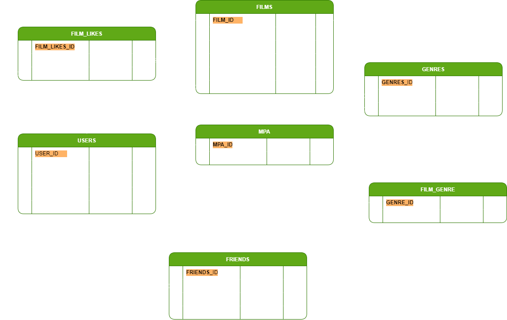

# java-filmorate
## Разработчик
Павлов Евгений Александрович
## Проект
Сервис, который будет работать с фильмами и оценками пользователей, а также возвращать топ-5 фильмов, рекомендованных
к просмотру.
## Проект создан для
Изучения и освоения навыков использования Spring Boot, Maven, Git, Postman, логирования, работа с библиатекой Lombok,
## Решены задачи
* Предварительная настройка проекта средствами Spring Boot
* Выполнено создание отдельной ветки в рипазитории для работы с проктом
* Реализовано добовление, обновление, получение информации о пользователях и фильмах с настройками валидации
## Технологии и их различия
* Применена система сборки Maven, позволяет подключить необходимые библиотеки(зависимости) в удобном наглядном виде
  и еще множество задач запуск тестов, анализ кода, построение отчетов и другое
* Применение инструментов аннотаций или испльзования методанных при разработке проекта позволяющая длать необходиммые
  надстройки, доблять функции с меньшимы затратами по времени код становится сжатый в объеме но с большей смысловой
  нагрузкой
* Применение регистрации информации при работе программы позволяет вывести информаци в необходимый ресурс
  с неоюходимой подробностью и эрарьхией важности
## Документация
* Java версии 11
* IntelliJ IDEA 2023.1.2 (Community Edition)
* Библиотеки:
* * org.springframework.boot
* * org.projectlombok
## Исходная ветка
controllers-films-users
## Целевая ветка
main
## ER Диаграмма 

## SQL
### Таблица FILM_GENRE
<pre><code> 
CREATE TABLE if not exists PUBLIC.FILM_GENRE (
	GENRE_ID INTEGER NOT NULL AUTO_INCREMENT,
	GENRE CHARACTER VARYING(64),
	CONSTRAINT FILM_GENRE_PK PRIMARY KEY (GENRE_ID),
	UNIQUE (GENRE)
);
CREATE UNIQUE INDEX if not exists PRIMARY_KEY_7 ON PUBLIC.FILM_GENRE (GENRE_ID);
</code></pre>

### Таблица MPA
<pre><code>
CREATE TABLE if not exists PUBLIC.MPA (
	MPA_ID INTEGER NOT NULL AUTO_INCREMENT,
	MPA_RATING CHARACTER VARYING(16),
	CONSTRAINT MPA_PK PRIMARY KEY (MPA_ID),
	UNIQUE (MPA_RATING)
);
CREATE UNIQUE INDEX if not exists PRIMARY_KEY_1 ON PUBLIC.MPA (MPA_ID);
</code></pre>

### Таблица FILMS
<pre><code>
CREATE TABLE if not exists PUBLIC.FILMS (
	FILM_ID INTEGER NOT NULL AUTO_INCREMENT,
	FILM_NAME CHARACTER VARYING(100),
	FILM_DESCRIPTION CHARACTER VARYING(200),
	FILM_RELEASE_DATE TIMESTAMP,
	FILM_DURATION INTEGER,
	MPA_ID INTEGER,
	CONSTRAINT DURATION_POSITIVE CHECK ("FILM_DURATION" >= 0),
	CONSTRAINT FILMS_MPA_FK FOREIGN KEY (MPA_ID) REFERENCES MPA (MPA_ID),
	CONSTRAINT FILMS_PK PRIMARY KEY (FILM_ID),
	CONSTRAINT FILM_RELEASE_DATE CHECK("FILM_RELEASE_DATE" > TIMESTAMP '1895-12-28 00:00:00')
);
CREATE INDEX if not exists FILMS_MPA_FK_INDEX_3 ON PUBLIC.FILMS (MPA_ID);
</code></pre>

### Таблица USERS
<pre><code>
CREATE TABLE if not exists PUBLIC.USERS (
	USER_ID INTEGER NOT NULL AUTO_INCREMENT,
	USER_EMAIL CHARACTER VARYING(64) NOT NULL,
	USER_LOGIN CHARACTER VARYING(64) NOT NULL,
	USER_NAME CHARACTER VARYING(64) NOT NULL,
	USER_BIRTHDAY DATE,
	CONSTRAINT DATE_PAST CHECK("USER_BIRTHDAY" <= LOCALTIMESTAMP),
	CONSTRAINT USERS_PK PRIMARY KEY (USER_ID),
	UNIQUE (USER_EMAIL),
	UNIQUE (USER_LOGIN)
);
CREATE UNIQUE INDEX if not exists PRIMARY_KEY_4 ON PUBLIC.USERS (USER_ID);
</code></pre>

### Таблица FRIENDS
<pre><code>
CREATE TABLE if not exists PUBLIC.FRIENDS (
	FRIENDS_ID INTEGER NOT NULL AUTO_INCREMENT,
	USER_ID INTEGER NOT NULL,
	FRIEND_ID INTEGER NOT NULL,
	CHECK_FRIEND BOOLEAN DEFAULT FALSE NOT NULL,
	CONSTRAINT FRIENDS_PK PRIMARY KEY (FRIENDS_ID),
	CONSTRAINT FRIENDS_UN UNIQUE (FRIEND_ID,USER_ID),
	CONSTRAINT U_NO_U CHECK("USER_ID" <> "FRIEND_ID"),
	CONSTRAINT FRIENDS_USER_FK FOREIGN KEY (USER_ID) REFERENCES PUBLIC.USERS(USER_ID) ON DELETE CASCADE ON UPDATE CASCADE,
	CONSTRAINT FRIENDS_FRIEND_FK FOREIGN KEY (FRIEND_ID) REFERENCES PUBLIC.USERS(USER_ID) ON DELETE CASCADE ON UPDATE CASCADE
);
CREATE UNIQUE INDEX if not exists PRIMARY_KEY_70 ON PUBLIC.FRIENDS (FRIENDS_ID);
CREATE UNIQUE INDEX if not exists FRIENDS_UN_INDEX_7 ON PUBLIC.FRIENDS (USER_ID,FRIEND_ID);
</code></pre>

### Таблица FILM_LIKES
<pre><code>
CREATE TABLE if not exists PUBLIC.FILM_LIKES (
	FILM_LIKES_ID INTEGER NOT NULL AUTO_INCREMENT,
	FILM_ID INTEGER,
	USER_ID INTEGER,
	CONSTRAINT FILM_LIKES_PK PRIMARY KEY (FILM_LIKES_ID),
	CONSTRAINT FILM_LIKES_FILMS_FK FOREIGN KEY (FILM_ID)  REFERENCES FILMS (FILM_ID) ON DELETE CASCADE ON UPDATE CASCADE,
	CONSTRAINT FILM_LIKES_USERS_FK FOREIGN KEY (USER_ID) REFERENCES USERS (USER_ID) ON DELETE CASCADE ON UPDATE CASCADE,
	CONSTRAINT FILM_ID_USER_ID UNIQUE (FILM_ID, USER_ID)
);
CREATE INDEX if not exists FILM_LIKES_FILMS_FK_INDEX_7 ON PUBLIC.FILM_LIKES (FILM_ID) ;
CREATE INDEX if not exists FILM_LIKES_USERS_FK_INDEX_7 ON PUBLIC.FILM_LIKES (USER_ID);
CREATE UNIQUE INDEX if not exists PRIMARY_KEY_7A ON PUBLIC.FILM_LIKES (FILM_LIKES_ID);
</code></pre>

### Таблица GENRES
<pre><code>
CREATE TABLE if not exists PUBLIC.GENRES (
	GENRES_ID INTEGER NOT NULL AUTO_INCREMENT,
	FILM_ID INTEGER,
	GENRE_ID INTEGER,
	CONSTRAINT GENRES_PK PRIMARY KEY (GENRES_ID),
	CONSTRAINT GENRES_UN UNIQUE (FILM_ID,GENRE_ID),
	CONSTRAINT GENRES_FILM_GENRE_FK FOREIGN KEY (FILM_ID)  REFERENCES FILMS (FILM_ID) ON DELETE CASCADE ON UPDATE CASCADE,
	CONSTRAINT GENRES_GENRE_FK FOREIGN KEY (GENRE_ID) REFERENCES FILM_GENRE (GENRE_ID) ON DELETE CASCADE ON UPDATE CASCADE
);
CREATE INDEX if not exists GENRES_FILMS_FK_INDEX_7 ON PUBLIC.GENRES (FILM_ID);
CREATE INDEX if not exists GENRES_FILM_GENRE_FK_INDEX_7 ON PUBLIC.GENRES (GENRE_ID);
CREATE UNIQUE INDEX if not exists PRIMARY_KEY_7D ON PUBLIC.GENRES (GENRES_ID);
</code></pre>